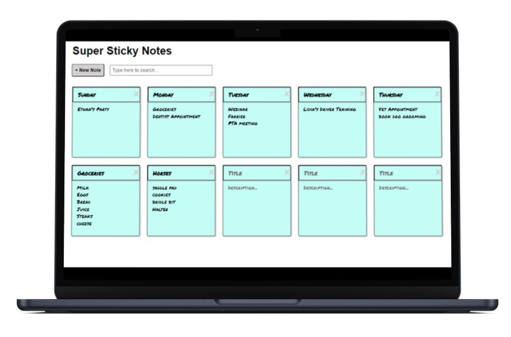

# Sticky Notes 

Save it on a sticky note! This React app allows the user to add, edit, delete, and search sticky notes during different sessions due to data being stored to local storage.

## Project Details

### View My Project: [https://6hrkeg.csb.app/](https://6hrkeg.csb.app/) 

## Features

- Create, edit, delete, and search notes
- Data is saved between sessions with lifecycle methods

## Technologies Used

- React
- CSS3
- JSX

## Acknowledgements

Project Idea: [Skillcrush](https://Skillcrush.com)

Original CSS provided by: [Skillcrush](https://Skillcrush.com)